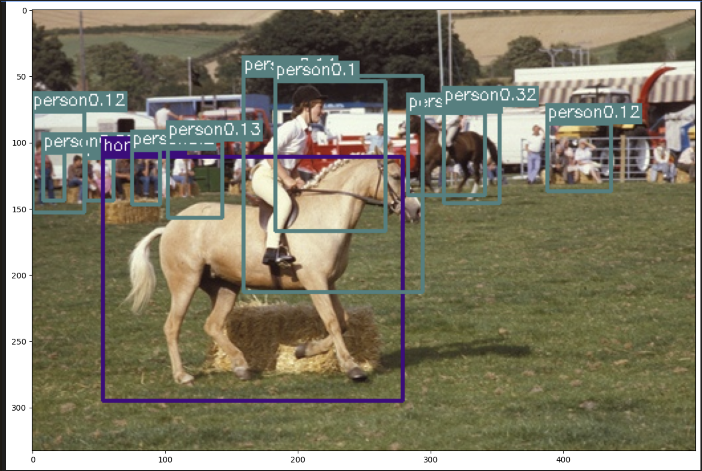

# YOLO Object Detection Project

A PyTorch implementation of a custom YOLO loss function for object detection, trained and evaluated on the VOC 2007 dataset using a ResNet50 backbone.

## Overview
This project demonstrates a complete pipeline for object detection using YOLO (You Only Look Once). It includes a custom loss function implementation and a training/evaluation workflow, achieving a mean Average Precision (mAP) of 0.24 on the VOC 2007 test set. The project showcases skills in PyTorch, deep learning, and computer vision, suitable for real-world object detection tasks.

## Features
- **Custom YOLO Loss**: Implements `YoloLoss` class in `yolo_loss.py`, handling:
  - Intersection over Union (IoU) for bounding box predictions.
  - Bounding box regression loss.
  - Confidence and classification losses for 20 VOC classes.
- **Training Pipeline**: Uses ResNet50 as the backbone, trained on VOC 2007 dataset.
- **Evaluation**: Achieves mAP of 0.24, with class-specific APs (e.g., horse: 0.49, car: 0.42).
- **Notebook**: Includes `yolo_training_voc2007.ipynb` for data loading, training, and visualization.

## Installation
To run this project, install the required dependencies:
```bash
pip install torch==2.0.0 torchvision==0.15.0 numpy==1.24.0 matplotlib==3.7.0 opencv-python==4.7.0
```

## Usage
Follow these steps to run the project:
1. Clone the repository:
   ```bash
   git clone https://github.com/DanLuoData/YOLO-Objection.git
   cd YOLO-Objection

2. Install dependencies (as above).
   Run the Jupyter Notebook:
   bashjupyter notebook yolo_training_voc2007.ipynb

3. Follow the notebook to:
   Load the VOC 2007 dataset.
   Train the YOLO model with ResNet50 backbone.
   Evaluate performance and visualize results.
## Results
Mean Average Precision (mAP): 0.24 on VOC 2007 test set.
Class-specific APs:

Horse: 0.49
Car: 0.42
Cat: 0.36
(See yolo_training_voc2007.ipynb for full results)


Example Detection:


## File Structure

yolo_loss.py: Custom YOLO loss function implementation.
yolo_training_voc2007.ipynb: Notebook for training and evaluating the YOLO model.
requirements.txt: List of Python dependencies.

## License 
This project is licensed under the MIT License - see the LICENSE file for details.

## Contact
Connect with me on LinkedIn or view my portfolio at www.linkedin.com/in/dan-luo-3b49732b3.

